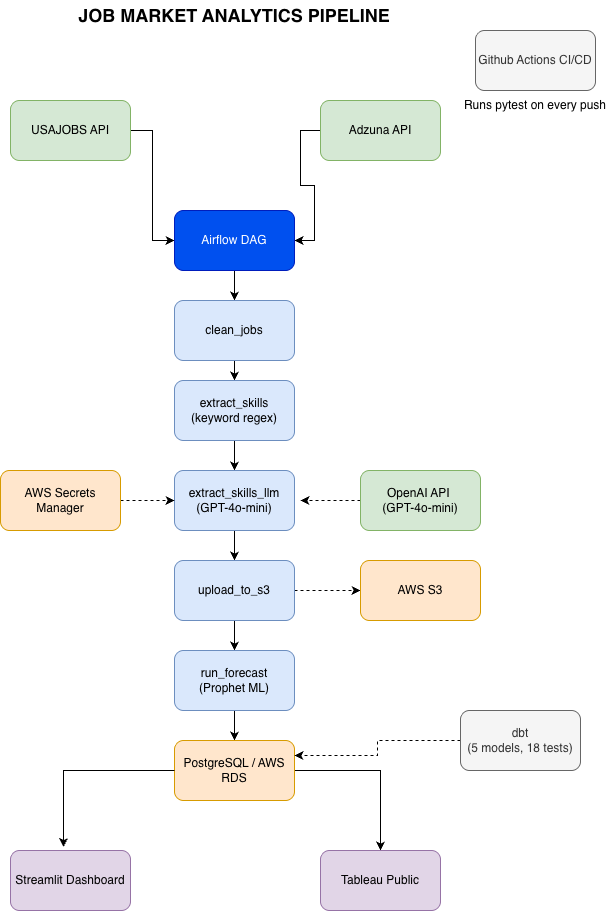

# Job Market Analytics Pipeline


An end-to-end data engineering pipeline that ingests up to 100 tech job postings daily from two APIs (USAJobs, Adzuna), transforms them through a Medallion Architecture using dbt, extracts required skills using keyword matching and LLM enrichment, and serves insights via an interactive Streamlit dashboard with 6-month skill demand forecasting.

📹 **Demo:** [Watch Loom walkthrough](https://loom.com/share/6e23d87debfd44d99df5e17e2c725b44)
📝 **Blog post:** [How I Built a Job Market Analytics Pipeline with Airflow, dbt, GPT-4o-mini, and Prophet](https://medium.com/@sanjana.sn.07/how-i-built-a-job-market-analytics-pipeline-with-airflow-dbt-gpt-4o-mini-and-prophet-d4c7e8c12253)

---

## Architecture



---

## Tech Stack

| Layer | Tools |
|---|---|
| Ingestion | Python, Apache Airflow, requests |
| Transformation | dbt (5 models, 18 data quality tests) |
| Storage | PostgreSQL, AWS S3, AWS RDS |
| AI Layer | OpenAI API — LLM skill extraction from job descriptions |
| ML Layer | Facebook Prophet — 6-month skill demand forecasting |
| Dashboard | Streamlit, Tableau Public |
| Testing | pytest (25 unit tests), dbt tests (18 data quality checks) |
| CI/CD | GitHub Actions — runs pytest on every push |
| Infrastructure | Docker, Docker Compose, AWS (S3, RDS, EC2) |

---

## Features

- **Dual-source ingestion** — pulls job postings daily from USAJobs (government) and Adzuna (private sector) APIs
- **Medallion Architecture** — Bronze (raw) → Silver (cleaned) → Gold (aggregated) data layers
- **dbt transformation pipeline** — 5 models with full lineage tracking and 18 automated data quality tests, run as a task inside the Airflow DAG
- **Keyword skill extraction** — regex-based extraction of 48 skills from job descriptions
- **LLM skill extraction** — OpenAI GPT-4o-mini enrichment to catch skills missed by keyword matching
- **Government vs private sector comparison** — side-by-side skill demand analysis across data sources
- **6-month forecasting** — Facebook Prophet ML model predicts which skills will be most in demand
- **Interactive dashboard** — Streamlit app with skill trend charts, filters, and forecast visualization
- **Tableau Public version** — stakeholder-facing dashboard for DA role applications
- **Cloud infrastructure** — AWS RDS for production database, AWS S3 for data lake storage
- **Automated testing** — 43 total checks: 25 pytest unit tests run in GitHub Actions on every push, and 18 dbt data quality tests run daily inside the DAG after the transformation step

---

## Data Pipeline DAG

8 tasks, `@daily`, `catchup=False`, 2 retries with a 5-minute delay:

```
ingest_usajobs ──┐
                 ├──→ clean_jobs → extract_skills → extract_skills_llm → upload_to_s3 → run_dbt → run_forecast
ingest_adzuna  ──┘
```

Both ingestion tasks run in parallel and fan in — cleaning only starts once both sources succeed.
`run_dbt` executes `dbt run && dbt test`, so the 18 data quality tests gate the forecast: if a test
fails, the task fails and `run_forecast` never runs on bad data.

---

## dbt Models

| Model | Layer | Type | Description |
|---|---|---|---|
| `stg_jobs` | Staging | View | Filters nulls, renames columns |
| `int_jobs_cleaned` | Intermediate | View | Adds seniority level, work type, salary flags |
| `int_skills_extracted` | Intermediate | View | Joins skills with job context |
| `mart_skill_trends` | Mart | Table | Weekly skill counts ranked by frequency |
| `mart_llm_vs_keyword_skills` | Mart | Table | Compares LLM vs keyword extraction coverage |

---

## Live Dashboards

| Dashboard | Link |
|---|---|
| 📊 Tableau Public | [View Dashboard](https://public.tableau.com/app/profile/sanjana.sringari.nataraju/viz/JobMarketAnalyticsDashboardPoweredbyAirflowdbtProphetML/Dashboard1) |
| 🖥️ Streamlit | Run locally (see setup below) |

---

## Setup

### Prerequisites
- Docker and Docker Compose
- Python 3.12+
- AWS account (for S3 and RDS)

### Environment Variables
Create a `.env` file in the project root:
```
USAJOBS_API_KEY=your_key
USAJOBS_EMAIL=your_email
ADZUNA_APP_ID=your_app_id
ADZUNA_APP_KEY=your_app_key
AWS_ACCESS_KEY_ID=your_key
AWS_SECRET_ACCESS_KEY=your_secret
AWS_BUCKET_NAME=your_bucket
AWS_REGION=us-west-1
RDS_HOST=your_rds_endpoint
RDS_PORT=5432
RDS_NAME=postgres
RDS_USER=pipeline_user
RDS_PASSWORD=your_password
DB_PASSWORD=pipeline_pass
OPENAI_API_KEY=your_openai_key   # only needed if not using AWS Secrets Manager
```

`job_market_dbt/profiles.yml` is committed and reads these same environment variables via
dbt's `env_var()`, so no credentials live in the repo. Its defaults point at the local Postgres
published on host port 5433; inside the Airflow containers docker-compose supplies
`DB_HOST=project-db` and `DB_PORT=5432`.

### Run Locally
```bash
docker-compose up -d
# Access Airflow UI at http://localhost:8080
# Username: airflow | Password: airflow
```

### Run dbt
The DAG runs dbt automatically as the `run_dbt` task. To run it by hand:
```bash
cd job_market_dbt
dbt run  --profiles-dir .                 # local development
dbt test --profiles-dir .                 # 18 data quality checks
dbt run  --profiles-dir . --target prod   # AWS RDS
```

### Run Tests
```bash
pip install pytest psycopg2-binary requests
pytest tests/ -v
```

---

## Status

✅ Complete — April 2026

- Dual-source ingestion pipeline (USAJobs + Adzuna)
- 8-task Airflow DAG — ingestion through dbt transformation to forecasting, fully automated
- Full Medallion Architecture with dbt (5 models, 18 tests)
- AWS S3 + RDS cloud integration + AWS Secrets Manager
- Keyword-based + LLM (GPT-4o-mini) skill extraction
- Facebook Prophet 6-month forecasting model
- Streamlit interactive dashboard
- Tableau Public dashboard (live URL above)
- 43 automated tests + GitHub Actions CI/CD
